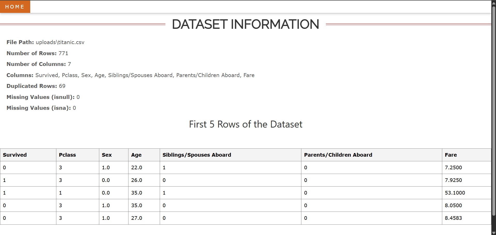

# 📊 DataNavigator

**DataNavigator** is a web-based application built using **Flask** that enables users to upload datasets, perform preprocessing, and visualize correlations through an intuitive interface. Ideal for beginners and non-technical users, it streamlines the data exploration process with features like encoding, outlier removal, and logistic regression.

---

## ✨ Features

- **Upload Dataset**: Accepts CSV files for analysis.
- **Column Selection**: Drop unnecessary columns and choose a target column.
- **Encoding Options**: Apply `OrdinalEncoder` or `OneHotEncoder` to categorical columns.
- **Correlation Heatmap**: Visualize feature correlations with Seaborn.
- **Box Plot Analysis**: Generate box plots for top correlated features.
- **Outlier Removal**: Clean data using the Interquartile Range (IQR) method.
- **Logistic Regression**: Apply logistic regression on the cleaned dataset.

---

## 📁 Project Structure

```
DataNavigator/
├── app.py                 # Flask app entry point
├── flask_session/         # Flask session management
├── static/                # CSS, JS, and other static files
├── templates/             # HTML templates (Jinja2)
├── uploads/               # Folder for uploaded CSVs
├── venv/                  # Virtual environment (excluded from Git)
└── requirements.txt       # Project dependencies
```

---

## ⚙️ Installation

### 1. Clone the Repository

```bash
git clone https://github.com/yourusername/data-navigator.git
cd data-navigator
```

### 2. Create a Virtual Environment

```bash
python -m venv venv
```

### 3. Activate the Virtual Environment

- **Windows**:
  ```bash
  venv\Scripts\activate
  ```
- **macOS/Linux**:
  ```bash
  source venv/bin/activate
  ```

### 4. Install Dependencies

```bash
pip install -r requirements.txt
```

### 5. Run the Application

```bash
python app.py
```

Visit the app at: [http://127.0.0.1:5000](http://127.0.0.1:5000)

---

## 🚀 Usage Guide

1. Launch the app in your browser.
2. Upload a CSV dataset.
3. Select columns to drop and pick a target column.
4. Apply encodings for categorical variables.
5. Generate a correlation heatmap.
6. View box plots of top features.
7. Remove outliers and apply logistic regression.

---

## 📦 Dependencies

- Flask
- Pandas
- Scikit-learn
- Seaborn
- Plotly

All dependencies are listed in `requirements.txt`.

---

## 📷 Demo





---

## 📄 Deployement
This app is deployed using render service.
Visit : https://data-navigator-v1-1.onrender.com 

After visiting the URL , you may be encountered with the following screen. Please wait for a while as render restarts the service
